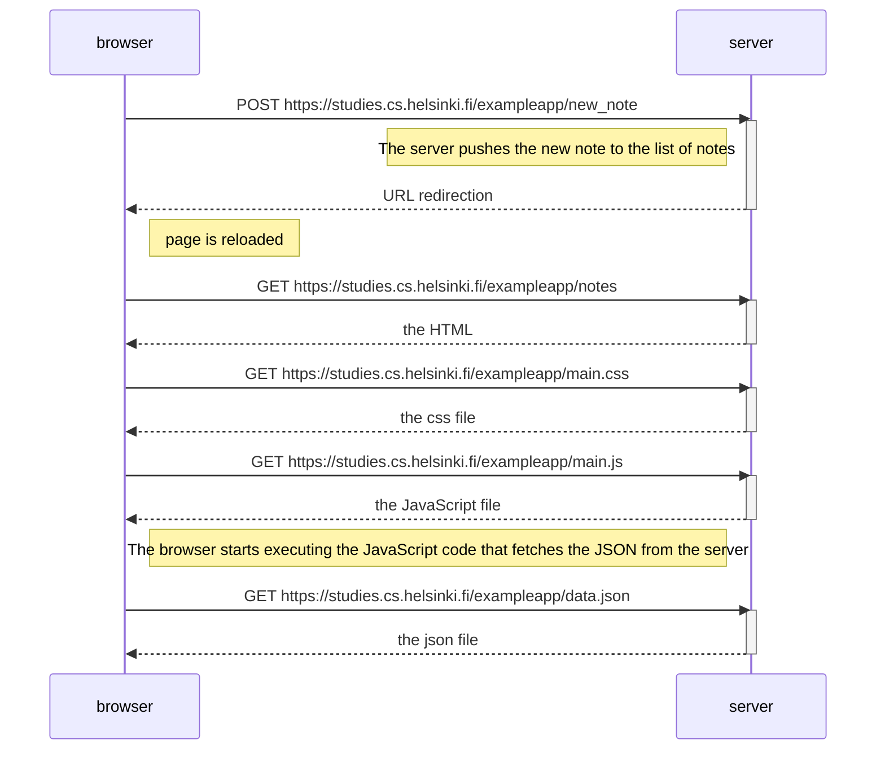

Osion 0 tehtävä 4:

```mermaid
  sequenceDiagram
      participant browser
      participant server
      
      browser->>server: POST https://studies.cs.helsinki.fi/exampleapp/new_note
      activate server
      Note left of server: The server pushes the new note to the list of notes
      server-->>browser: URL redirection
      deactivate server

      Note right of browser: page is reloaded
      
      browser->>server: GET https://studies.cs.helsinki.fi/exampleapp/notes
      activate server
      server-->>browser: the HTML
      deactivate server
      
      browser->>server: GET https://studies.cs.helsinki.fi/exampleapp/main.css
      activate server
      server-->>browser: the css file
      deactivate server

      browser->>server: GET https://studies.cs.helsinki.fi/exampleapp/main.js
      activate server
      server-->>browser: the JavaScript file
      deactivate server
      
      Note right of browser: The browser starts executing the JavaScript code that fetches the JSON from the server
      
      browser->>server: GET https://studies.cs.helsinki.fi/exampleapp/data.json
      activate server
      server-->>browser: the json file
      deactivate server    
```
